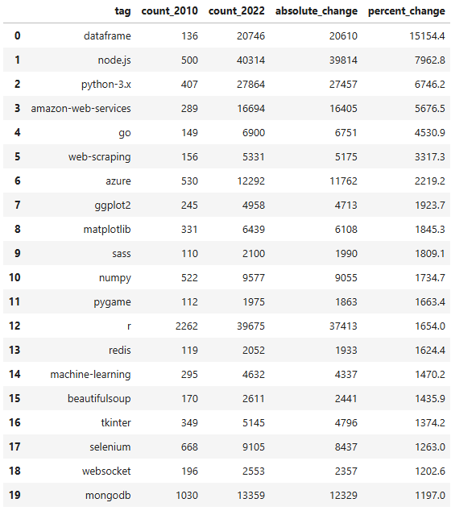
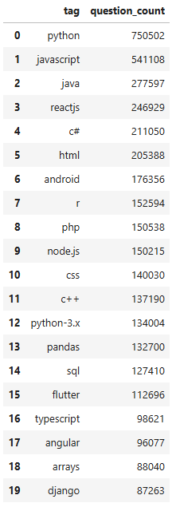
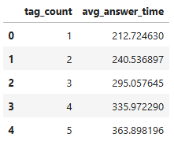

# Stack Overflow SQL Case Study (BigQuery)

## Problem
Use the public Stack Overflow BigQuery dataset to identify technology trends, user growth patterns, expert vs beginner behaviour, and what drives faster answers.

## What I built
A pure-SQL analysis on BigQuery (Python only runs queries + displays results) using millions of posts across 2010–2022, plus a focused answer-speed analysis on 2020 for runtime.

## Key outputs (results)
- **Fastest-growing tags (2010 → 2022):** `dataframe` **+15,154%** (136 → 20,746), `node.js` **+7,963%** (500 → 40,314), `python-3.x` **+6,746%** (407 → 27,864), `amazon-web-services` **+5,677%** (289 → 16,694), `go` **+4,531%** (149 → 6,900).
- **What dominates recently (2020–2022):** `python` **750,502** questions, `javascript` **541,108**, `java` **277,597**, `reactjs` **246,929**, `c#` **211,050** (plus `pandas` **132,700**, `sql` **127,410**, `typescript` **98,621**).
- **Behaviour + answer speed:** India peaked at **116,328** new users (2017) vs US **103,653** (2017); beginners over-index on `vba` **173,809 vs 4,540 experts (38×)** and `excel` **225,559 vs 6,658 (34×)**. Narrow questions get faster answers: **1 tag = 212.7h** vs **5 tags = 363.9h**; titles **<30 chars = 231.8h** vs **>70 chars = 327.5h**; high-score questions wait longer (**6+ score = 1,212.5h**) vs negative-score (**34.1h**).

## Tech
BigQuery SQL (CTEs, `UNNEST(SPLIT())` tag explosion, conditional aggregation, `CASE` bucketing, joins incl. FULL OUTER JOIN, `SAFE_DIVIDE`, time-series grouping, `TIMESTAMP_DIFF`); Python only for execution + simple matplotlib charts.

## Data & scope
- Dataset: `posts_questions`, `posts_answers`, `users` (BigQuery public dataset)
- Time window: 2010–2022 (answer-speed focused on 2020 for runtime)

## Links
- **Notebook (GitHub):** `stack-overflow-sql.ipynb`
- **Kaggle notebook:** https://www.kaggle.com/code/martynasdiugas/stack-overflow-sql

## Screenshots (proof)

### Tag growth 2010–2022

### Top tags 2020–2022

### Answer speed

## Notes / limitations
- Location is free-text → country extraction is approximate.
- “Beginner vs expert” uses reputation buckets (<1000 vs ≥10000) → strong signal, not perfect ground truth.
- Answer-speed uses time to **first** answer (not accepted answer).
